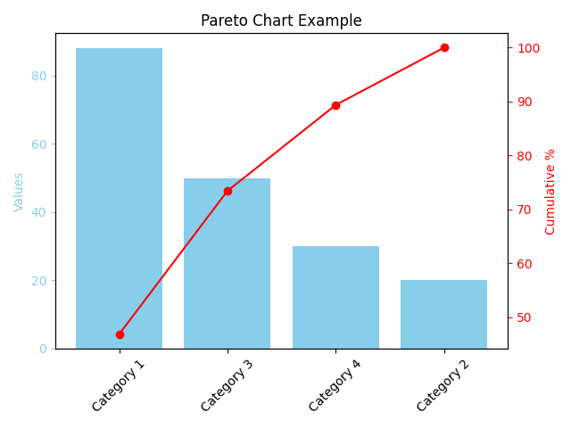

# ParetoViz - Pareto Chart Visualization in Python



## Overview

**ParetoViz** is a simple Python project that demonstrates how to create a Pareto Chart using `matplotlib` and `pandas`.  
A Pareto Chart combines a bar chart and a line graph to highlight the most significant factors in a dataset, following the Pareto principle (80/20 rule).

This project is useful for beginners who want to visualize categorical data and analyze the cumulative impact of categories.

---

## Features

- Reads data from a CSV file (`data/sample_data.csv`)  
- Sorts data by value descending  
- Plots a bar chart for individual category values  
- Overlays a cumulative percentage line chart  
- Saves the chart as an image (`images/pareto_example.png`)  
- Easy to customize and extend

---

## Project Structure

```

ParetoViz/
│
├── data/
│   └── sample\_data.csv         # Sample input data
│
├── images/
│   └── pareto\_example.png      # Output Pareto chart image
│
├── utils/
│   └── helpers.py              # Utility functions (e.g., cumulative % calculation)
│
├── pareto\_chart.py             # Main plotting script
├── requirements.txt            # Python dependencies
└── README.md                   # Project documentation (this file)

````

---

## Installation

1. Clone the repository:
   ```bash
   git clone https://github.com/Kirankumarvel/ParetoViz.git
   cd ParetoViz
````

2. (Optional) Create a virtual environment and activate it:

   ```bash
   python -m venv venv
   source venv/bin/activate      # Linux/macOS
   venv\Scripts\activate         # Windows PowerShell
   ```

3. Install dependencies:

   ```bash
   pip install -r requirements.txt
   ```

---

## Usage

Run the script to generate and display the Pareto chart:

```bash
python pareto_chart.py
```

The chart image will be saved in the `images` directory as `pareto_example.png`.

---

## How It Works

* The script loads category and value data from `data/sample_data.csv`.
* Data is sorted in descending order by value.
* A bar chart shows individual category values.
* A line graph overlays the cumulative percentage to illustrate the Pareto principle.
* Utility function `calculate_cumulative_percent` computes cumulative percentages.

---

## Customize

* Update `sample_data.csv` with your own categories and values.
* Modify `pareto_chart.py` to change colors, labels, or add more customization.

---

## Dependencies

* `matplotlib` - For plotting charts
* `pandas` - For data handling

See `requirements.txt` for exact versions.

---

## License

This project is open source under the MIT License.

---

## Contact

Created by Kirankumarvel
GitHub: [https://github.com/Kirankumarvel/ParetoViz](https://github.com/Kirankumarvel/ParetoViz)

---

## References

* Pareto Principle: [Wikipedia](https://en.wikipedia.org/wiki/Pareto_principle)
* Matplotlib Documentation: [https://matplotlib.org/stable/contents.html](https://matplotlib.org/stable/contents.html)
* Pandas Documentation: [https://pandas.pydata.org/docs/](https://pandas.pydata.org/docs/)

```

